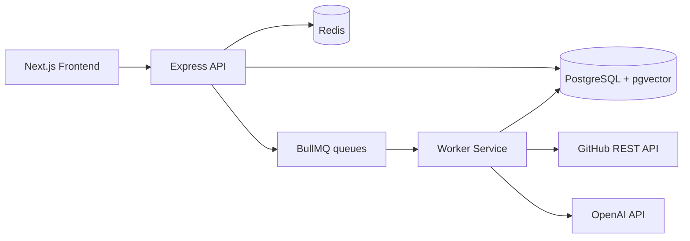

# AI Project Archaeologist

AI Project Archaeologist is a three-service TypeScript application for indexing GitHub repositories, analyzing source code, and generating AI-assisted explanations, documentation, and architecture views.

## Services

- `Frontend`: Next.js App Router UI for authentication, dashboards, search, chat, documentation, and architecture views.
- `Backend/api`: Express REST API for auth, GitHub integration, repository management, RAG queries, and job orchestration.
- `Backend/worker`: BullMQ worker for cloning repositories, static analysis, embedding generation, indexing, and documentation jobs.

## First Milestone

This scaffold implements the production foundation requested in the brief:

- Workspace layout for frontend, API, and worker.
- Strict TypeScript configuration.
- Prisma schema for users, repositories, indexing, chats, documentation, architecture graphs, audit logs, and vector embeddings.
- Express API foundation with validation, consistent responses, JWT auth, repository/service layers, and centralized errors.
- Worker queue skeleton for repository indexing.
- Next.js foundation with Auth Context, React Query, Axios, Tailwind, CSS Modules, and core pages.

## Local Setup

1. Copy environment files:

```bash
cp Backend/api/.env.example Backend/api/.env
cp Backend/worker/.env.example Backend/worker/.env
cp Frontend/.env.example Frontend/.env.local
```

2. Start infrastructure:

```bash
docker compose up -d
```

3. Install dependencies:

```bash
npm install
```

4. Generate Prisma client and run the apps:

```bash
npm run prisma:generate --workspace Backend/api
npm run dev:api
npm run dev:worker
npm run dev:frontend
```

## Architecture


